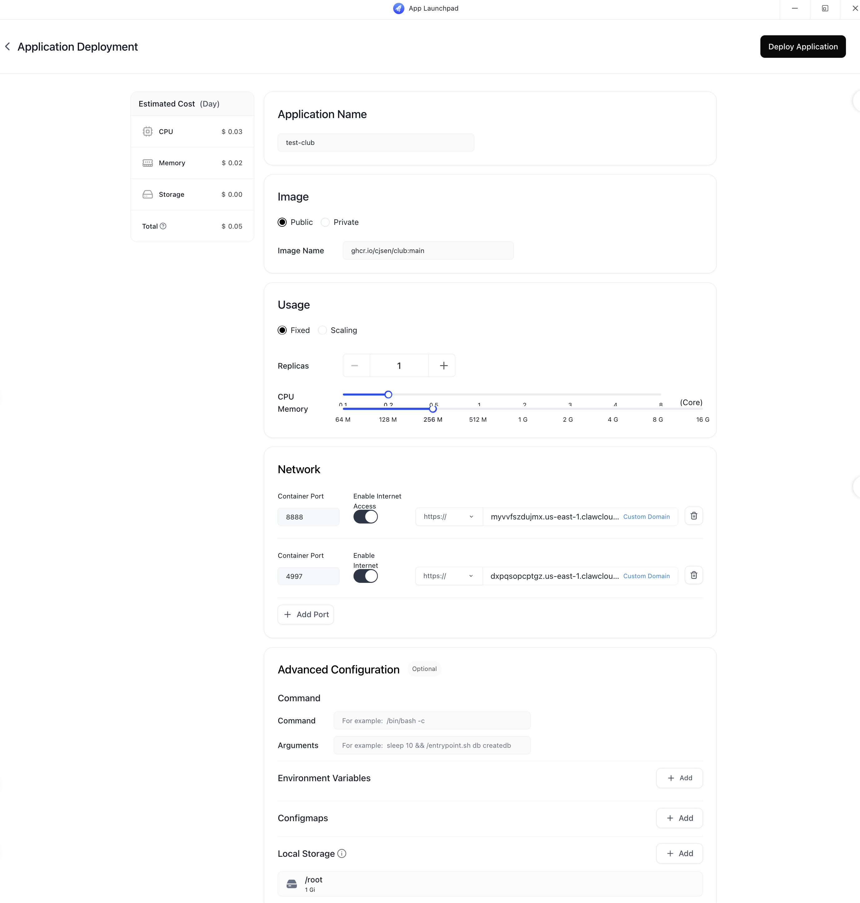
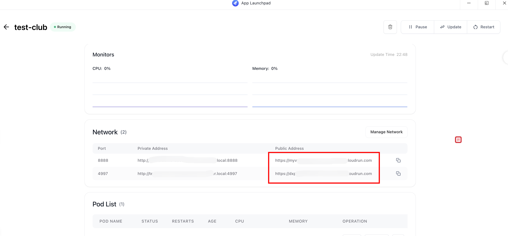
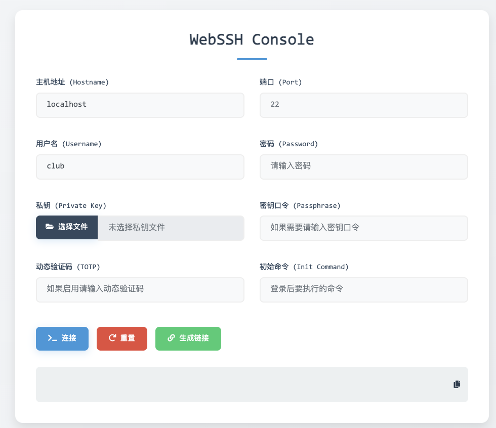
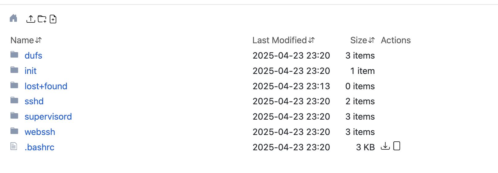

# ClawCloud 环境说明

在使用 ClawCloud 过程中，发现其使用k8s的pod容器，所以在重启或者其他操作后，会还原系统，而且不能挂载整个“/”目录做持久化，所以搞了一个自用镜像。
本仓库为 ClawCloud 的application提供一个ubuntu 22.04环境，集成了自定义 uv Python 环境、WebSSH 远程连接和 dufs 文件上传服务，方便使用。

## 主要功能

- **自定义 uv Python 环境**：内置 uv、uvx，支持现代 Python 包管理和虚拟环境。
- **WebSSH 自启动**：容器启动后自动运行 WebSSH，便于通过网页安全连接终端。
- **dufs 文件上传**：集成 dufs，支持通过网页上传/下载文件，提升文件管理效率。
- **supervisord 管理**：集成 supervisord，可同时管理多个服务，如 WebSSH、dufs 等。
- **vim，ping，ifconfig**：安装了 vim，ping，ifconfig 等常用命令

## 快速开始

1. **clawcloud镜像运行**：
   - 创建 app，名称随意，镜像按照图上步骤进行创建。
   ``` bash
   ghcr.io/cjsen/club:main
   ```
   - CPU 和内存根据自身需求调整，按照图上来的话，每天的费用大概在 $0.05/day。每月五美元完全够用。
   - 端口开放 5000（dufs）和 8888（webssh），并打开 "Enable Internet Access" 按钮。
   - 挂载 /root 目录，大小自己调整。
   - 点击右上角 "deploy application"，等待容器启动(可能会超时，镜像比较大，没关系，直接返回在点进来就好了)
   

2. **访问服务**：
   
   访问面板，点击对应的 public address，即可访问服务。
   - webssh：
      - hostname: localhost
      - username:club
      - password:123456
      
   - dufs：
      - username:club
      - password:123456
      

## 安全提醒（务必阅读）

<font color="red">**首次启动后，请务必立即完成以下操作：**</font>

1. **修改系统用户 club 的密码**
   进入容器后执行：
   ```bash
   passwd club
   ```

2. **修改 dufs 的访问密码**
   dufs 默认密码为弱密码，请及时在 `supervisord.conf` 或相关配置中更改为强密码，并重启服务。
   ```bash
   sudo supervisorctl restart dufs
   ```

## 目录结构

- `bin/`：包含 uv、uvx、webssh、dufs 可执行文件
- `configs/`：supervisord 及相关配置
- `entrypoint.sh`：容器启动脚本

## 其他说明

- 建议定期更新镜像，及时修复安全漏洞。
- 如需自定义 Python 包或工具，请参考 uv 官方文档。

---

如有问题欢迎提 issue 或联系维护者。

你可以根据实际端口和配置进一步补充细节。